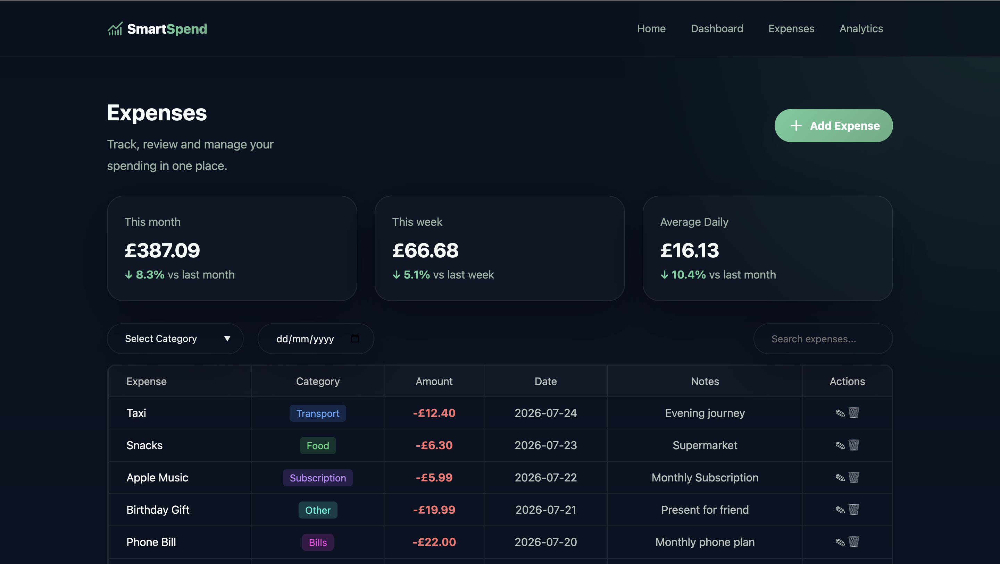
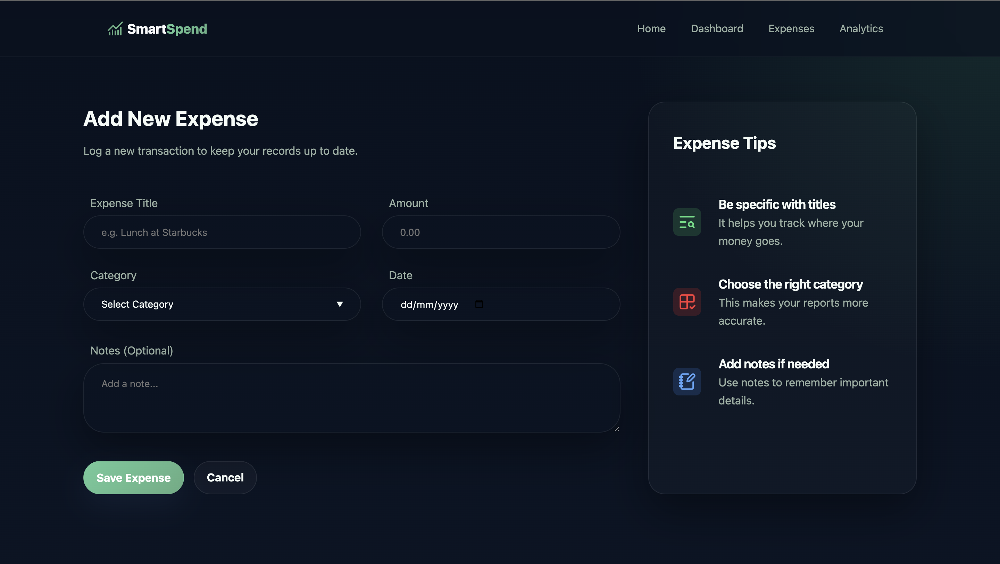

# 💸 SmartSpend

SmartSpend is a personal finance analytics platform built with **Flask**, **SQLite**, and vanilla web technologies. It helps users track expenses, monitor spending, and gain insights into their financial habits.


The project starts as a clean Flask application, then grows feature by feature into a cutting-edge web application for expense tracking, analytics, and future machine learning experiments.

---

## ✨ Current Features

- Modern responsive dashboard
- Expense management page
- Add Expense form
- Dynamic expense tracking with Flask
- Categorised expenses
- Clean dark UI with green accent theme

---

## 🚧 Features in Progress

- Analytics dashboard
- Edit and delete expenses
- Search and filtering
- SQLite database integration
- User authentication
- Spending charts and visualisations

---

## 🛠️ Tech Stack

- Python
- Flask
- HTML5
- CSS3
- Jinja2
- Git & GitHub

---

## 📂 Project Structure

```
SmartSpend/
│
├── app.py
├── database.py
├── schema.sql
├── templates/
├── static/
│   ├── css/
│   ├── js/
│   └── images/
└── README.md
```

---

## 📸 Screenshots

## Home


## Expenses



## Add Expense



---

## 🎯 Future Goals

- Store expenses using SQLite
- Build interactive analytics
- Add secure user authentication
- Deploy the application online

---

## Run Locally

```bash
python app.py
```

Then open:

```text
http://127.0.0.1:5000
```
